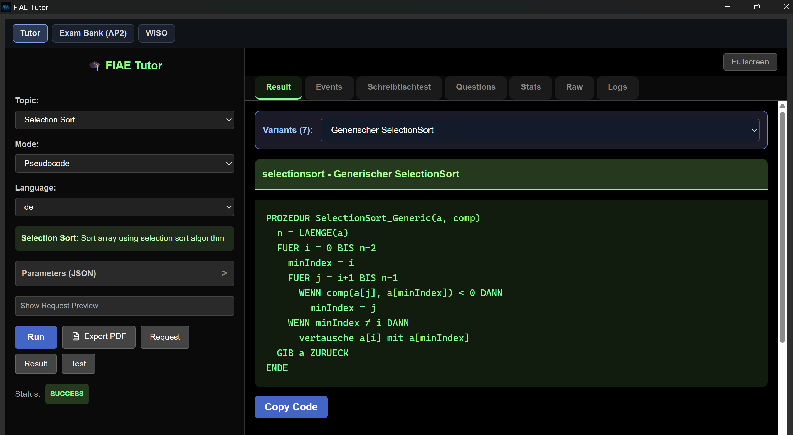
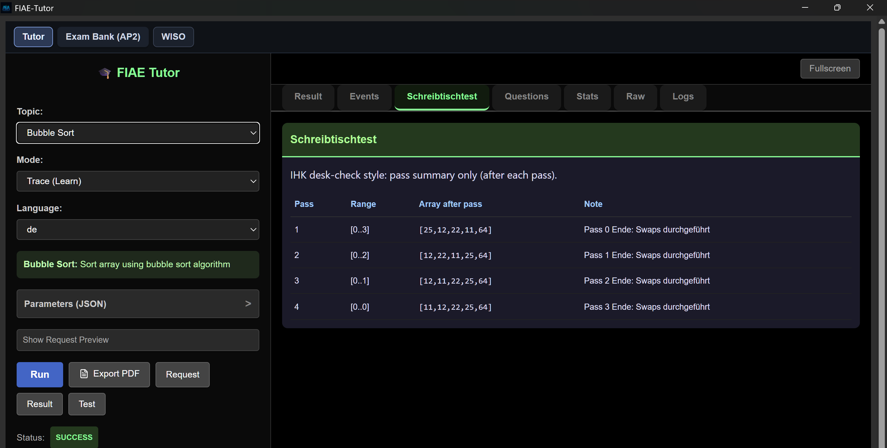
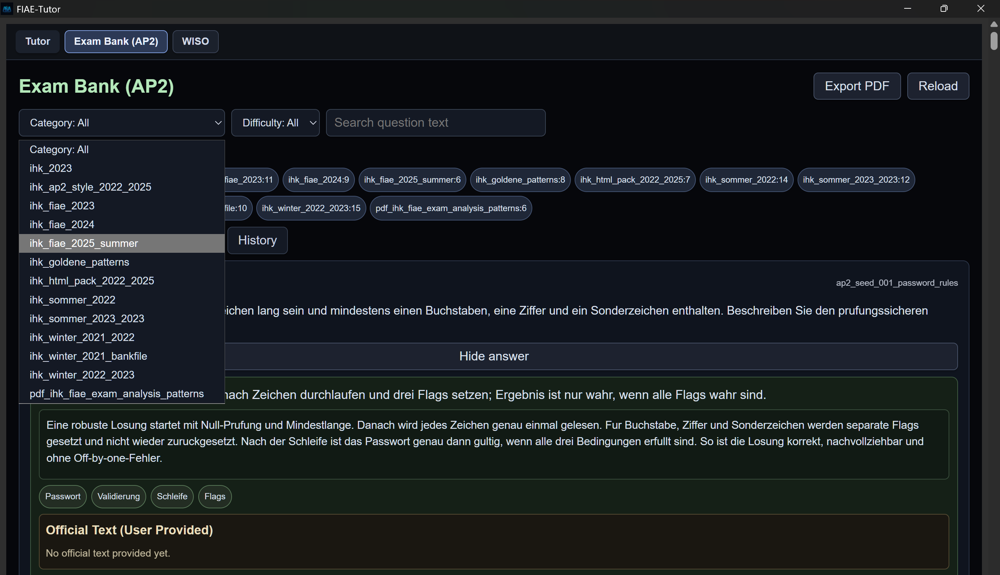
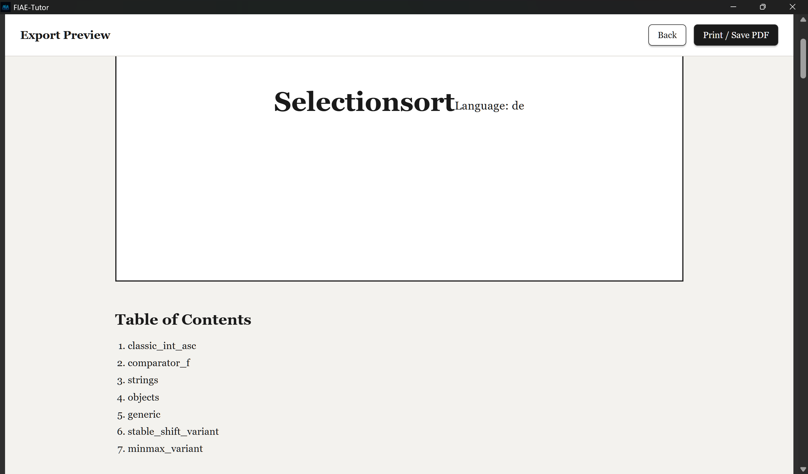

<div align="center">

# FIAE Tutor Desktop

**Desktop learning platform for German IHK FIAE exam preparation**

[](https://react.dev/)
[](https://www.typescriptlang.org/)
[](https://tauri.app/)
[](./LICENSE)

*Algorithm training · Pseudocode practice · Desk-check simulations · AP2 exam bank · Bilingual (German / Persian)*

</div>

---

## Why this project?

Preparing for the IHK FIAE exam requires understanding algorithms, pseudocode and desk-check (Schreibtischtest) techniques — but there were no tools that combined all of this with bilingual support for German and Persian learners.

FIAE Tutor Desktop fills that gap: a focused, offline-capable desktop app built specifically for FIAE exam candidates.

---

## Screenshots

### Topic Registry & Algorithm Variants

*Each algorithm contains multiple exam-oriented variants used in IHK FIAE examinations.*

### Pseudocode Generation

*Interactive pseudocode generation with German IHK-style keyword formatting.*

### Desk-Check Simulation (Schreibtischtest)

*Step-by-step algorithm tracing and exam-style desk-check training.*

### AP2 Exam Bank

*Integrated question bank with categories, difficulty filters and search.*

### PDF Export

*Generate printable learning materials and algorithm documentation.*

---

## Features

- **Algorithm Tutor** — Selection Sort, Bubble Sort, Insertion Sort with multiple exam variants
- **German Pseudocode** — IHK-style keyword generation (`FUER`, `BIS`, `WENN`, `AUSGABE`)
- **Schreibtischtest** — step-by-step trace visualization for desk-check practice
- **AP2 Exam Bank** — searchable question bank with difficulty tags and PDF export
- **Topic Registry** — structured architecture organizing all learning modules
- **Bilingual content** — German and Persian (Farsi) learning materials
- **Offline-capable** — desktop app via Tauri, no internet required

---

## Technology Stack

| Layer | Technology |
|-------|------------|
| Frontend | React 18, TypeScript, Vite |
| Desktop runtime | Tauri 2.x (Rust) |
| Styling | Tailwind CSS |
| Export | HTML → PDF generation |
| CI | GitHub Actions |

---

## Project Structure

```
src/
├── domain/          # Core algorithm logic and exam data models
├── views/           # Page-level components
├── components/      # Reusable UI components
└── services/        # PDF export, data loading

src-tauri/
├── src/             # Rust backend (window management, file system)
└── icons/

data/
└── exam_bank/       # AP2 exam questions (JSON)

exam_tools/
├── json_to_html.py       # Convert exam JSON to HTML preview
└── validate_exam_json.py # Validate exam bank structure
```

---

## Getting Started

```bash
# Clone the repository
git clone https://github.com/aryanbarak/fiae-tutor-desktop.git
cd fiae-tutor-desktop

# Install dependencies
npm install

# Run in browser (dev mode)
npm run dev

# Run as desktop app (requires Rust + Tauri CLI)
npm run tauri dev
```

> **Note:** Tauri requires Rust to be installed. See [tauri.app/start](https://tauri.app/start/) for setup instructions.

---

## Target Audience

- Fachinformatiker Anwendungsentwicklung (FIAE) candidates
- IHK AP1 / AP2 exam candidates
- Self-learners studying algorithms and pseudocode
- German-speaking and Persian-speaking IT learners

---

## Author

**Aryan Barakzai**
Fachinformatiker Anwendungsentwicklung (IHK) · Germany

[](https://barakzai.cloud)
[](https://github.com/aryanbarak)
[](https://www.linkedin.com/in/aryan-barakzai)

---

## License

MIT License — see [LICENSE](./LICENSE) for details.
